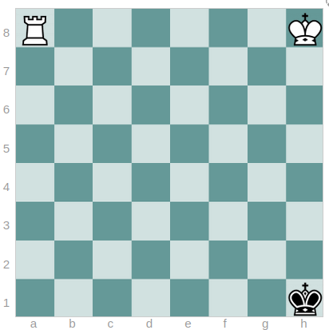
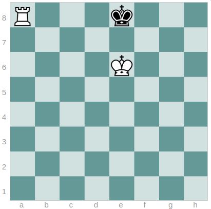
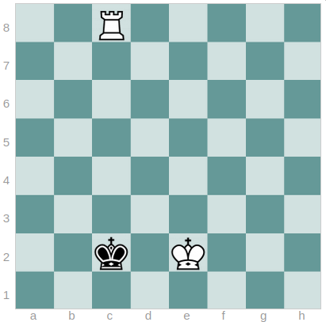

# Goal Generation & Reinforcement Learning

This project explores goal-conditioned reinforcement learning using the Reinforcement Learning with Imagined Goals (RIG) approach, proposed by Nair et al. in 2018 (https://arxiv.org/abs/1807.04742), originally used for robotic tasks.

It focuses on learning latent representations of observations and training an agent to achieve diverse goals by sampling targets in a learned latent space.

Please refer to the PDF in the current directory for more detailed information about this project. To run the scripts, first apply the modifications specified in the modifs_gym_chess file.

 

## Agent Tasks

The objective of the chosen study is to generate positions of the chess game and to learn to the agent to achieve the requested configuration. The considered chess positions are those King and white Rook versus Black King, as well as King versus King.

The objective is therefore to learn a latent representation of these positions using a generative model, then to learn to the agent (the Whites) to achieve these specific positions.

A major constraint quickly appeared concerning the use of RIG (or any other method) for the realization by an agent of chess positions. In the paper by Ashvin Nair and Vitchyr Pong, the algorithm is used on robotic tasks, for example moving with a robotic arm all kinds of different objects to certain positions. Contrary to the original application framework of RIG, the agent in the chess environment cannot force a specific position on the chessboard.

From this observation, which applies regardless of the considered chess environment, I decided to drastically restrict the positions of the black king and to guide its actions. I thus considered three problems, leaving each more or less freedom to the Black King in the choice of its moves.

### First task and associated environment

The Black King starts the episode at h1 and only performs actions that bring it closer (except when it finds itself there, being unable to pass over the Rook). The objective for the agent is to move its pieces in such a way as to reach the position White King at h8, White Rook at a8, and Black King at h1.

The idea is that the Black King remains overall in the same area of the chessboard regardless of the actions taken by the agent, and sufficiently far from the agent’s pieces so that the problem can be reduced to a simple positioning of pieces by the agent without considering external influences from the latter.

 
<em>Goal Position</em>

### Second task and associated environment

The Black King starts on the eighth rank and only performs actions to remain there; it may eventually move down to the seventh rank if it has no other choice, but attempts to return to the eighth rank as soon as possible. It scans the last rank from left to right and then, having arrived at the edge, changes direction.

The aim here is to force it to regularly return to square e8, where the objective of checkmate with the White pieces will be tested, in the position White Rook at a8, White King at e6, and Black King at e8.

 
<em>Goal Position</em>

### Third task and associated environment

Here, we consider that the Black King is entirely free in its actions as long as they are legal. Its actions are therefore chosen randomly. The objective is to learn to the agent to checkmate the Black King. Since a specific position cannot be imposed, we average in the latent space over all possible checkmate positions (168 positions).

Although we average over the latent space, I doubt that this works in theory, as it may in some cases bring the Black King towards an edge but will not encourage the agent to place its pieces correctly with respect to the Black King’s position to checkmate. Failing to be able to train the agent to checkmate, it may be interesting to see if the agent learns the only technique to force the opposing king to move backward, namely the opposition of the kings followed by the check with the rook.

 
<em>Goal: Force the black king to the edge to checkmate it</em>

 

## Results

The results can be viewed in the project’s `.mp4` files. As can be seen in the videos, the results obtained are not satisfactory. Although the training of the VAE and the policy, complex, did not succeed, this project was the opportunity to understand and put into practice the Reinforcement Learning method RIG.

The two combined mechanisms of this method, the learning of a latent representation and the training of a policy compatible with diverse latent goals, may be promising for applications to the game of chess.
Using a latent space would make it possible to obtain achievable latent goals by averaging over a set of positions that would be difficult to obtain individually.

Using a goal-conditioned policy would make it possible to train an agent for all types of tasks desired in the game of chess, depending on the phase of the game: succeeding in the opening, taking the center, putting its king to safety, promoting its pawns, checkmating in the endgame.

I plan to revisit this project later with the goal of at least solving First Task, the simplest one presented.
